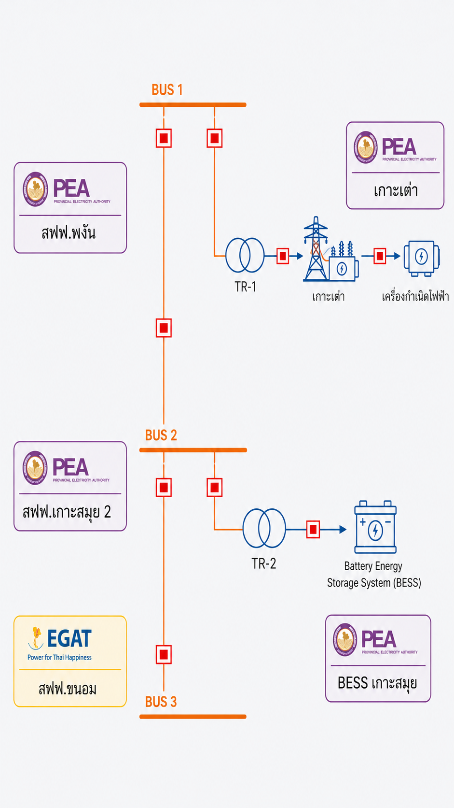

# Grid Guardian — Smart EMS Dashboard

A real-time energy management dashboard for the **Koh Tao Island Smart Grid** (Provincial Electricity Authority of Thailand — PEA). The dashboard visualises 24-hour load forecasting, optimal dispatch scheduling, BESS state-of-charge, cost analysis, and early-warning alerts for island grid operators.



---

## Features

- **Load Forecast Chart** — 80% confidence interval, MAPE ≤ 5.4%, overlaid with metered actuals and early-warning markers (critical / warning / info)
- **Dispatch Power Chart** — Stacked bar chart for grid import, diesel, BESS discharge/charge, and solar PV across 24 hours
- **BESS State-of-Charge** — Area chart with 20%–90% operating limit reference lines
- **Recommended Dispatch Schedule** — Scrollable 24-hour table with PDF dispatch order export
- **Cost Analysis** — Donut chart breakdown (fuel / grid / BESS) with week-on-week comparison
- **Early Warning Panel** — Severity-stratified alerts with operator action prompts
- **Scenario Switching** — Toggle between Baseline, BESS-Optimal, and Diesel-Heavy dispatch scenarios
- **Ask Agent** — AI-assisted Q&A (preset questions with Thai-language responses)
- **Live Clock** — Real-time HH.MM.SS header display

---

## Tech Stack

| Layer | Library / Tool |
|---|---|
| Framework | React 18 |
| Language | TypeScript 5 (strict mode) |
| Build | Vite 5 |
| Charting | Recharts 2 |
| Styling | Tailwind CSS 3 (custom `pea-purple` palette) |
| Icons | Lucide React |

---

## Getting Started

### Prerequisites

- Node.js ≥ 18
- npm ≥ 9

### Install & Run

```bash
# Clone the repository
git clone https://github.com/<your-org>/grid-guardian-frontend.git
cd grid-guardian-frontend

# Install dependencies
npm install

# Start development server (http://localhost:5173)
npm run dev
```

### Build for Production

```bash
npm run build      # TypeScript check + Vite bundle → dist/
npm run preview    # Preview the production build locally
```

---

## Project Structure

```
src/
├── components/        # Reusable UI components
│   ├── Header.tsx                     # Navbar + KPI strip + live clock
│   ├── SingleLineDiagram.tsx          # Electrical schematic viewer
│   ├── PowerSourcesCard.tsx           # Energy source status
│   ├── KpiCard.tsx                    # Reusable KPI metric badge
│   ├── MainForecastChart.tsx          # Load forecast + early-warning markers
│   ├── DispatchPowerChart.tsx         # Stacked dispatch bar chart
│   ├── BessSocChart.tsx               # BESS state-of-charge area chart
│   ├── RecommendedDispatchSchedule.tsx # 24-hour dispatch table + PDF export
│   ├── EarlyWarningPanel.tsx          # Alert panel
│   ├── CostAnalysisCard.tsx           # Cost breakdown donut chart
│   ├── AskAgentCard.tsx               # AI agent chat
│   └── BottomStatusBar.tsx            # Footer status + scenario controls
├── pages/
│   └── DashboardPage.tsx             # Layout orchestrator (3-column grid)
├── data/
│   └── mockDashboardData.ts          # Mock data + 3 dispatch scenarios
└── types/
    └── index.ts                      # TypeScript interfaces
public/
├── PEA-Logo.png
├── adjusted-single-line-diagram.png
└── kohtao_dispatch_order_17h30.pdf
```

---

## Dispatch Scenarios

| # | Name | Description |
|---|---|---|
| 0 | Baseline | Mixed diesel + grid + BESS + solar (HiGHS optimizer output) |
| 1 | BESS Optimal | BESS-heavy, zero diesel commitment |
| 2 | Diesel Heavy | Diesel covers load, BESS remains idle |

Scenario data was generated by a Python optimizer (HiGHS solver) for a stress-day profile on Koh Tao island.

---

## Deployment

This project is deployed on **Vercel**. See [DEPLOYING.md](DEPLOYING.md) for the full deployment guide, or follow the quick steps below.

### Deploy to Vercel (one-click)

[](https://vercel.com/new/clone?repository-url=https://github.com/<your-org>/grid-guardian-frontend)

### Manual Vercel Deployment

```bash
npm i -g vercel
vercel        # follow prompts — framework auto-detected as Vite
```

Vercel settings:
- **Framework Preset:** Vite
- **Build Command:** `npm run build`
- **Output Directory:** `dist`
- **Install Command:** `npm install`

---

## Roadmap

- [ ] Connect to live SCADA / optimizer REST API
- [ ] Dynamic `NOW_HOUR` from system clock
- [ ] Error boundaries and loading states
- [ ] Vitest + React Testing Library test suite
- [ ] Responsive layout (tablet / mobile)
- [ ] ARIA labels and semantic HTML for accessibility
- [ ] i18n support (Thai / English toggle)
- [ ] Scenario-aware PDF report generation
- [ ] Real LLM integration for Ask Agent

---

## License

Private — Provincial Electricity Authority of Thailand (PEA). All rights reserved.
